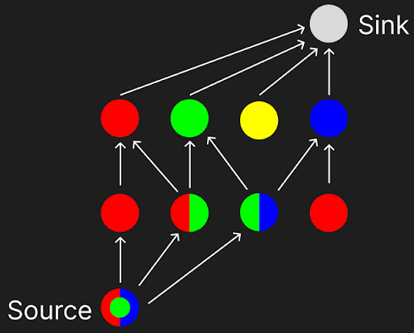

# Capstone Project: Time-Sensitive Networking (TSN) Algorithms
----------------------------------------
This repository contains the C++ implementation and Python interface for evaluating various routing and scheduling algorithms in Time-Sensitive Networking (TSN).<br>

## Problem Statement
Our goal is synthesizing a network topology and schedule which satisfies the fault-resilience constraints for TT(Time triggered or periodic) traffic while minimizing cost.<br>
Fault resilience constraints are expressed in terms of TL(Tolerance level). A message with TL = n, must be sent via n edge disjoint paths when it is scheduled to be sent.<br>
Each TT Message is represented by a 5 tuple **(src, dest, size, period, tl)**<br>
Where,<br>
&ensp; &ensp; **src** = source node of the message<br>
&ensp; &ensp; **dest** = destination node of the message<br>
&ensp; &ensp; **size** = amount of time a meassage occupies on a link node of the message<br>
&ensp; &ensp; **period** = how often a message must be sent<br>
&ensp; &ensp; **tl** = Tolerance Level of the message<br>

### Promblem Inputs
 
&ensp; &ensp; **Ne** = Number of terminal nodes (Message src and sink are always terminal nodes)<br>
&ensp; &ensp; **Nb** = Number of bridge nodes<br>
&ensp; &ensp; **M** = List of 5 Tuples describing the messages we need to schedule<br>
&ensp; &ensp; **Link_cost** = Cost of building links <br>
&ensp; &ensp; **Node_Cost** = Cost of buliding a node based on number of links attached to it<br>
&ensp; &ensp; **Link_limit** = Maximum links a node can have<br>

### Problem Outputs:
&ensp; &ensp; Network Topology<br>
&ensp; &ensp; Routes for all messages<br>
&ensp; &ensp; Starting time for each message<br>

## Main Algorithms & Functions
The core algorithmic logic is implemented in C++ and handles different approaches to scheduling and routing for TSN flows:<br>
The following algorithms are available with the same call syntax:    <br>

**JTRSS**: The baseline algorithm. It is a implementation of JTRSS as explained in this [paper](https://ieeexplore.ieee.org/document/8474201/)<br>
**holistic_JTRSS**: A modification of JTRSS that changes the way in which parts of a message are scheduled so that "greedy choice" of a message is affected by other messages.<br>
**my_algo**: A custom algorithm proposed by me for TSN scheduling.<br>
**my_optimized_algo**: A version of my_algo with performance improvements due to reusing computation. This produces the same outputs as my_algo.<br>
**my_holistic_algo**: Combining the new algorithm with the holistic scheduling strategy used in holistic_algo.<br>

### C++ call syntax
```
    AlgoResults [Function Name](int num_ecu,int num_bridges,vector<Message> M,int Bridge_limit,int link_build_cost,int yens_kmax,int assignment_type,int verbose,int debug_print)
```
&ensp; &ensp; **num_ecu**: Number of terminal nodes<br>
&ensp; &ensp; **num_bridges**: Number of bridge nodes<br>
&ensp; &ensp; **M**: Array of all message tuples<br>
&ensp; &ensp; **Bridge_limit**: Link_limit<br>
&ensp; &ensp; **link_build_cost**: Cost of building links<br>
&ensp; &ensp; **yens_kmax**: Maximum paths yens algorithm will consider (in algo and holistic_algo),unused in my_algo variations<br>
&ensp; &ensp; **assignment type**: Used to control asignment behaviour in algo and holistic_algo, unused in my_algo<br>
&ensp; &ensp; **verbose**: Prints a summary of the routes found by the algorithm<br>
&ensp; &ensp; **debug print**: toggles some debuging output.<br>


### Python - C++ Interface
The computationally heavy routing and scheduling algorithms are written in C++ and exposed to Python using Pybind11 (defined in binding.cpp).This architecture allows the system to leverage C++ for low-level memory management and execution speed, while utilizing Python for validating algorithm assignments, analyzing outputs, generating LaTeX tables etc.When compiled, the interface generates a dynamic module (e.g., tsn.cp312-win_amd64.pyd on Windows) that can be imported directly into Python:

```
    import tsn
```
## Algorithm explaination

### JTRSS
The Algorithm Schedules messages one by one, For a given message the algorithm iteratively finds non-overlapping least cost paths until we satisfy the tolerance level constraint.We prioritize scheduling “hardest” messages first i.e More frequent messages first and then bigger size messages first. As messages with higher period have a longer time to be scheduled and are therefore more likely to find a route in the given graph.

### A Scenario in which JTRSS is suboptimal

1) Schedule "Fragmentation"
Similiar to fragmentation of memory in Operating systems the greedy nature of JTRSS and it’s design of scheduling message by message combine to create sub optimal scheduling.
Consider the minimal example of 2 messages:
<0,1,3,5,1>
<0,1,3,10,1>
JTRSS Will only be able to schedule message one due to its greedy nature. We can see that there is enough overall free space for message 2 to be scheduled but fragmentation occurs.


To tackle this Flaw we have come up with Holistic JTRSS as well as different assignment types than greedy

### Holistic JTRSS
JTRSS has a lack of ability to consider all other messages while scheduling any single given message. To remedy this instead of going message by message we propose a more holistic way of assigning messages. We treat each repeat of the message as independant and service these according to 

<earliest departure time (asc), latest arrival time(asc), maximum time of transit(asc), greatest size (desc)> 

This “holistic order” makes it so that greedy choice of the later instances of a message is affected by other messages.

### Assignment Types (For JTRSS Variants)
When deciding the time slot for a path multiple strategies are available
1) Assignment Type 0 (Greedy Strategy): for any path we choose the earliest time when it is available
2) Assignment Type 1 (Best Fit Strategy): We define a fragmentation metric and then instead of greedily picking time, we choose the time which minimizes this metric.
3) Assignent Type 2 (Points Approach): We assign points to each timestep and we we try to assign a message in the schedule in a way that will maximise these “points”.These points are based on the periods of the messages we have to schedule causing grouping towards the ends of the periods and leaving vacancy in the middle which can be used be messages with longer periods.

### Other "Flaws" in JTRSS which could be improved on

1) Iterative Asssignment of Disjoint Paths:
Since JTRSS assigns these paths greedily aswell it might be that taking shortest path for one disjoint might block others. While a longer path would haev allowed everything to be scheduled before the deadline

2) 2D Scheduling:
Since JTRSS Schedules paths in 2D graph using yens algorithm it can not consider some possible edge disjoint paths where a node is repeated. This reduces the solution space JTRSS is able to consider.

### Motivation for Proposing a new Algorithm
I my opinion the above 2 flaws can only be adressed by designing a algortihm from the ground up.
So I propose a new Algorithm

### my_algo
The new algorithm structure was motivated by the desire to use a algorithm like dijkstra on a 3D graph directly so that
1) we don’t have to play around with different assignment methods like we did before.
2) We can get over the problem of 2D Scheduling

The idea of this algorithm is to work backwards from the destination and propagate possible paths back to the source. We then chose the least cost paths at the source to schedule the message.



To enforce edge-disjointness we have made it so that each connection (u,v) can only have one color across all timesteps when scheduling a message, since there is only one replica sent along a color we can be assured that all replicas take edge disjoint paths.

Since there is a range of acceptable departure times and arrival times colors are propagated back from more than one destination node and can end up at more than one source node.

It also schedules messages in th same order as JTRSS

## Compilation Instructions
The project uses CMake to orchestrate the compilation of the C++ source files alongside the Pybind11 Python extension.

Prerequisites
A modern C++ compiler (GCC, Clang, or MSVC)

CMake installed

Python 3.x and pybind11 installed in your environment (pip install pybind11)

### Build Steps
#### Clone the repository:

Bash
```
git clone https://github.com/ewilipsic/CapstoneThings.git
cd CapstoneThings
```
#### Generate the build files:
Create a separate build directory to keep the root clean, then configure the project with CMake:

Bash
```
mkdir build
cd build
cmake .. 
```
(Note: If CMake cannot find your Python environment automatically, you may need to pass -DPYTHON_EXECUTABLE=/path/to/python)

#### Compile the project:
Build the extension in release mode to ensure the C++ optimizations are fully applied:

Bash
```
cmake --build . --config Release
```
#### Run the Module:
After compilation, the build process will output the compiled binary library (e.g., .so on Linux/macOS or .pyd on Windows). Ensure this file is located in the same directory as your Jupyter Notebooks or Python scripts to successfully import tsn.
